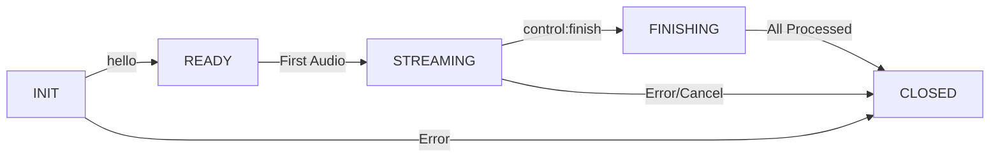
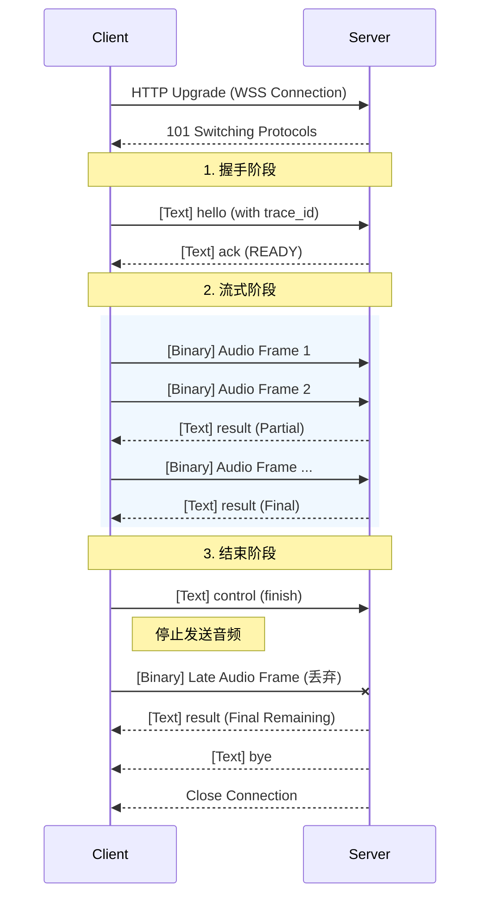

# 🎙️ 实时语音识别流式协议规范 (v1.0.0)

| 属性 | 说明 |
| --- | --- |
| **版本** | **v1.0.0 (Final Release)** |
| **状态** | **Stable** |
| **最后更新** | 2026-02 |
| **传输协议** | WebSocket over TLS (WSS) |
| **适用场景** | 实时 ASR |

---

## 1. 设计目标与原则

* **极简传输 (Low Overhead)**
* **控制层**：JSON 文本帧传输元数据与识别结果。
* **数据层**：二进制帧传输裸音频，无应用层头部 (Headerless)。
* **网络层**：客户端和服务端必须设置 TCP_NODELAY 选项，禁用 Nagle 算法，确保小包实时发送。


* **隐式时序 (Implicit Timing)**
* 移除音频帧内时间戳。
* 通过“**帧长契约 + 包计数**”推演时间，避免客户端时钟漂移问题。


* **严格契约 (Strict Contract)**
* Opus 模式必须固定帧长、关闭 DTX。
* PCM 模式必须固定帧长。


---

## 2. 连接与鉴权

### 2.1 连接地址

* **URL**: `wss://api.example.com/v1/stream`
* **Method**: `GET`

### 2.2 鉴权方式

1. **Header 鉴权**
* `Authorization: Bearer <access_token>`


---

## 3. 会话状态机

### 3.1 状态定义

| 状态 | 说明 | 关键行为约束 |
| --- | --- | --- |
| **INIT** | WebSocket 已连接 | 仅允许发送 `hello`，忽略 Binary 帧。 |
| **READY** | 已完成握手 (ack 已发送) | 允许开始发送音频流。 |
| **STREAMING** | 正在接收音频帧 | 允许发送音频、Ping、Control。 |
| **FINISHING** | 收到 finish，正在处理尾音 | 服务端丢弃所有后续 Binary 帧，仅处理缓存数据。 |
| **CLOSED** | 会话已结束或异常终止 | 断开 TCP 连接。 |

### 3.2 状态迁移图



---

## 4. 交互时序图



---

## 5. 消息定义：文本帧 (JSON)

### 5.1 客户端 → 服务端

#### 🔹 hello（握手与配置）

```json
{
  "type": "hello",
  "app_id": "your-app-id",
  "trace_id": "client-uuid-v4",
  "config": {
    "codec": "opus",
    "sample_rate": 16000,
    "channels": 1,
    "frame_duration_ms": 20
  }
}

```

#### 🔹 control（流控制）

```json
{
  "type": "control",
  "action": "finish"
}

```

**支持动作 (Action)**：

| Action | 语义 |
| --- | --- |
| **finish** | 自然结束。服务端进入 `FINISHING` 状态并丢弃后续 Binary 帧。在 `FINISHING` 状态下，服务端应忽略除 `cancel` 以外的所有 `control` 动作。 |
| **cancel** | 立即丢弃所有缓存数据并关闭连接。 |


#### 🔹 ping/pong（心跳）

```json
{
  "type": "ping",
  "timestamp_ms": 16789000
}

```

```json
{
  "type": "pong",
  "timestamp_ms": 16789000
}

```

### 5.2 服务端 → 客户端

#### 🔹 ack（握手确认）

```json
{
  "type": "ack",
  "session_id": "sess-uuid-v4",
  "trace_id": "client-uuid-v4",
  "status": "ok"
}

```

#### 🔹 result（识别结果）

```json
{
  "type": "result",
  "session_id": "sess-uuid-v4",
  "seq_no": 7,  // 第 7 个识别结果包
  "data": {
    "text": "今天天气真不错",
    "is_final": true,
    "confidence": 0.96,
    "timestamp_ms": {
      "start": 1500,
      "end": 2800
    }
  }
}

```

#### 🔹 error（错误反馈）

```json
{
  "type": "error",
  "code": 4003,
  "message": "Opus frame duration mismatch",
  "trace_id": "client-uuid-v4",
  "timestamp_ms": 16789000
}

```

---

## 6. 消息定义：二进制帧 (Binary Frame)

### 6.1 帧结构

* **Header**: 无
* **Payload**: 裸音频字节
* **边界**: WebSocket Frame 边界即数据包边界 (Message-based)

### 6.2 编码模式规范

#### 模式 A：PCM（调试 / 内网）

* **格式**: Raw PCM, 16-bit, Signed Integer, Little Endian
* **帧长契约**：必须固定（推荐 20ms）。
* **严格校验公式（Strict Equality）**：
`
PayloadBytes = SampleRate * (BitDepth / 8) * Channels * T_frame
`


* **示例** (16kHz, 16bit, 单声道, 20ms):
`16000 * (16 / 8) * 1 * 0.02 = 640 Bytes`


#### 模式 B：Opus（生产 / 公网）

* **格式**: 标准 Opus Packet (RFC 6716)，**无 Ogg 封装**
* **打包规则**: 1 WebSocket Frame = 1 Opus Packet
* **严禁**: 粘包（多帧合并）、拆包（单帧拆分）
* **DTX**: **必须关闭**
* **帧长约束**: 本协议要求固定帧长编码（通常 20ms）
* **传输设置**: 客户端和服务端必须设置 TCP_NODELAY 选项，禁用 Nagle 算法，确保小包实时发送

---

## 7. 心跳与超时机制

定义基础时间单位 `T_frame` 为握手时协商的 `frame_duration_ms`（单位：毫秒，通常 20ms）。

### 7.1 心跳策略 (Connection Liveness)

* **客户端**: 每 5–10 秒发送一次 `ping`。
* **服务端**: 收到 `ping` 后必须返回 `pong`。
* **目的**: 保持 TCP 活跃，防止 NAT 超时；检测应用层死锁。

### 7.2 超时策略 (Stream Health)

| 场景 | 阈值定义 | 行为 |
| --- | --- | --- |
| **网络抖动警告** | 连续 `> 3 * T_frame` 未收到包 | 服务端记录 Warning，不中断 |
| **数据流超时** | 连续 `> 500 * T_frame` (≈ 10s) 未收到包 | 返回错误 `4008` 并关闭连接 |
| **连接假死** | 连续 `> 1500 * T_frame` (≈ 30s) 无应用层心跳 | 服务端主动关闭连接 (TCP RST) |

---

## 8. 服务端时间戳推演逻辑

服务端不信任客户端系统时间，完全基于**收到的合规帧数量**推演音频流时间。

`
CurrentTime = FrameCount * T_frame
`

* **Opus**: 每收到 1 个合规包，时间推进 `+ T_frame`。
* **PCM**: 每收到 1 个合规包，时间推进 `+ T_frame`。

---

## 9. 服务端异常流处理

本节定义导致连接强制断开的“可观测异常现象”。

| 异常现象 (Observable Phenomenon) | 判定逻辑 | 处理策略 | 错误码 |
| --- | --- | --- | --- |
| **PCM 帧长不匹配** | `Size_recv != Size_expected` | **立即断开** | 4006 |
| **Opus 解码异常** | `DecodedSamples != SampleRate * T_frame` （服务端会进行自动重采样） | **立即断开** | 4003 |
| **单帧过大** | `DecodedDuration > 20ms` | **立即断开** | 4007 |
| **未握手发包** | `State == INIT && Msg == Binary` | **立即断开** | 4005 |
| **Finish 后发包** | `State == FINISHING && Msg == Binary` | **静默丢弃** | N/A |

> **注**：所有异常判定基于可观测现象，服务端不推断客户端原因。

---

## 10. 状态码 (Error Codes)

| Code | Type | Description | Action |
| --- | --- | --- | --- |
| **1000** | Info | 正常关闭 | 无 |
| **4001** | Client | JSON 格式错误或字段缺失 | 修复 Payload |
| **4002** | Client | 不支持的采样率或编码配置 | 修复 Config |
| **4003** | Client | Opus 解码后时长不匹配（或 DTX 开启） | 关闭 DTX / 修正编码器 |
| **4005** | Client | 未发送 hello 即发送音频 | 修复客户端流程 |
| **4006** | Client | PCM 帧长字节数不符合契约 | 修复采集/封包逻辑 |
| **4007** | Client | 单帧数据过大 (> limit) | 检查编码器配置 |
| **4008** | Client | 数据传输超时 (>10s) | 检查网络 |
| **4029** | Client | 请求过多 (Too Many Requests) | 遵守限流策略 |
| **5000** | Server | 引擎内部错误 | 重试 |
| **5003** | Server | 数据流异常中断 | 重连 |

---

## 11. 客户端开发 Checklist

1. [ ] **Trace ID**: 生成 UUID v4 并放入 `hello` 包。
2. [ ] **Little Endian**: 确认 PCM 字节序。
3. [ ] **Disable DTX**: Opus 编码器必须关闭静音检测，发送静音包。
4. [ ] **Frame Alignment**:
* PCM: `640 bytes` (16k/20ms) 严格切分。
* Opus: `20ms` 严格切分。
5. [ ] **No Header**: Binary Frame 不加任何自定义头部，仅发送 Payload。
6. [ ] **Drain Buffer**: 客户端在发送 `finish` 前，必须确保音频队列中的最后一帧数据已完全写入。
7. [ ] **Finish Policy**: 发送 `finish` 后，立即停止写入音频数据。
8. [ ] **Reconnection**: 断开后必须重新握手，不支持 Session Resume。
9. [ ] **Socket Config**：客户端和服务端必须设置 TCP_NODELAY 选项，禁用 Nagle 算法，确保小包实时发送。