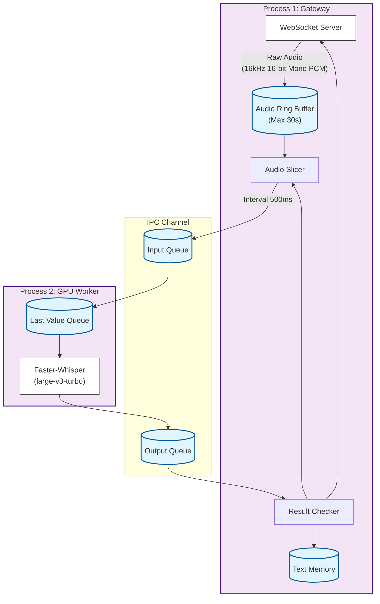

# Babylon - Realtime ASR

```mermaid
graph TD
    %% ==========================================
    %% 进程 1: WS网关
    %% ==========================================
    subgraph P1 ["Process 1: Gateway"]
        direction TB
        
        WSGateway["WebSocket Server"] 
        -->|"Raw Audio<br/>(16kHz 16-bit Mono PCM)"| RingBuf[("Audio Ring Buffer<br/>(Max 30s)")]
        RingBuf --> Slicer["Audio Slicer"]

        ResCheck["Result Checker"] --> TextMem[("Text Memory")]
        ResCheck --> Slicer
        ResCheck --> WSGateway
        
    end

    %% ==========================================
    %% IPC 通信层
    %% ==========================================
    subgraph IPC1 ["IPC Channel"]
        Slicer -->|"Interval 500ms"| Q_In[("Input Queue")]
    end
    subgraph IPC1 ["IPC Channel"]
        Q_Out[("Output Queue")] --> ResCheck
    end

    %% ==========================================
    %% 进程 2: ASR引擎（GPU推理）
    %% ==========================================
    subgraph P2 ["Process 2: GPU Worker"]
        direction TB
        
        Q_In --> LVQ[("Last Value Queue")] --> Whisper["Faster-Whisper<br/>(large-v3-turbo)"]
        
        Whisper --> Q_Out
    end

    %% 样式
    classDef buffer fill:#e1f5fe,stroke:#01579b,stroke-width:2px;
    classDef process fill:#f3e5f5,stroke:#4a148c,stroke-width:2px;
    classDef component fill:#fff,stroke:#333,stroke-width:1px;
    classDef urgent fill:#ffcdd2,stroke:#b71c1c,stroke-width:2px;
    
    class RingBuf,TextMem,Q_In,Q_Out,LVQ buffer;
    class P1,P2 process;
    class WSGateway,Silero,Whisper component;
    class FinalTask,ResFinal urgent;
```